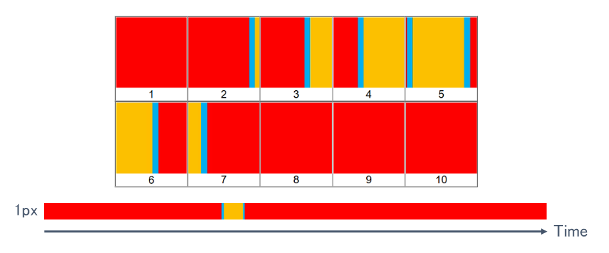
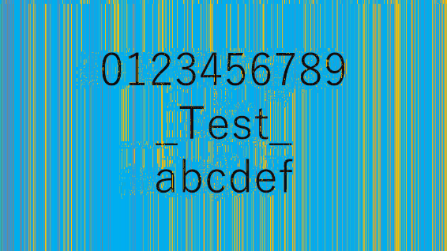
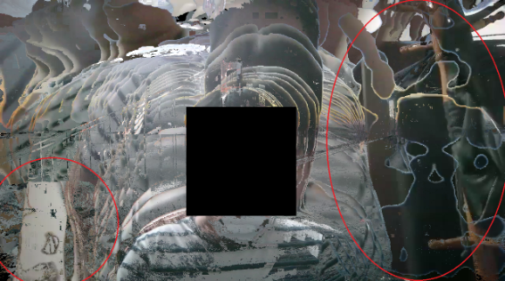
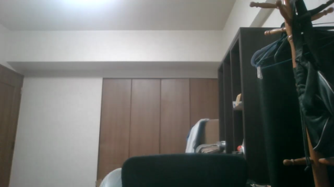

# Roomg-Attack
Privacy invasion attack that reconstruct real rooms through holes in virtual background.  

## What is Roomg-Attack?
Roomg-Attack is a privacy invasion attack that uses the instability of virtual background.
Recently, COVID-19 has required us to work from home.
The real background of the room is a treasure trove of information, the view outside the window identifies the location of our home, and the objects represent personality.
To protect our privacy we use virtual background.
This attack is an invasion of privacy by reconstructing the real background through the cracks in that virtual background.

## New attack surface
We found that the holes in virtual background contain at least one pixel of information about the real background.
The faster we move, the wider this hole gets, but no one in the world is paying attention.
**This is 0day of the real world.**

  

We manually collected and pieced together the red circles in the image. Fortunately we have many frames.
The result was fabulous!
We were able to reconstruct a real background.

  

The problem with this attack is that it is very time consuming, but it shows that an attacker can extract real room information if he takes the time.

## Automation algorithm
First, the ideal video is used.
In the ideal video, the virtual background is red, the real background is light blue, and the human is yellow.
After that, it is applied to the actual video.

  

The basic idea is to reconstruct the room by trusting that virtual background immediately hides the real background and choosing a color with a short appearance time for each pixel.
The following images are enlarged and arranged in the same section of the ideal video.

  

Looking at the color of a single pixel over time, the light blue virtual background appears the least.
The pseudo code to collect this is simple.

---

<details><summary><strong>code</strong></summary><div>

```python
import cv2
import sys
import time
import numpy
import collections
from tqdm import tqdm

args = sys.argv
filename = args[1]

video = cv2.VideoCapture(filename)
if not video.isOpened():
    print("c('o'c)")
    print("plz {}".format(filename))
    sys.exit()

h = int(video.get(cv2.CAP_PROP_FRAME_HEIGHT))
w = int(video.get(cv2.CAP_PROP_FRAME_WIDTH))
f = 0 #int(video.get(cv2.CAP_PROP_FRAME_COUNT))

frame = []
while True:
    ret, tmp = video.read()
    if not ret:
        break
    f += 1
    frame.append(tmp)

print("c('-'c)")
print("-" * 50)
print("Height:{}\nWidht:{}\nFrame:{}".format(h, w, f))
print("-" * 50)
omg = int(input("omg:"))
print("-" * 50)

omgc = 0
image = [[0] * w for i in range(h)]

bar = tqdm(total = h * w)
bar.set_description('Progress')

start = time.time()

#"""
for i in range(h):
    for j in range(w):
        colors = []
        most = []
        n = -1
        for k in range(f):
            colors.append(str(frame[k][i][j].tolist()))
        for k in (collections.Counter(colors).most_common()[0][0]).replace("[", "").replace("]", "").split(', '):
            most.append(int(k))
        while True:
            least = []
            for k in (collections.Counter(colors).most_common()[n][0]).replace("[", "").replace("]", "").split(', '):
                least.append(int(k))
            n -= 1
            if most == least:
                least = []
                for k in (collections.Counter(colors).most_common()[-1][0]).replace("[", "").replace("]", "").split(', '):
                    least.append(int(k))
                break
            if abs(sum(most) - sum(least)) > omg:
                omgc += 1
                break
        image[i][j] = numpy.array(least)
        bar.update(1)
    #print("{}/{}:{:.2f}s".format(i + 1, h, time.time() - start))
#"""

bar.close()

print("omgc:{}".format(omgc))
print("Time:{:.2f}".format(time.time() - start))
print("-" * 50)

cv2.imwrite('{}_room_{}.png'.format(filename.replace(".mp4", ""), omg), numpy.array(image))

print("b(^0^b)")
```

</div></details>

---

The ideal video can be reconstructed.

  

As the number of frames and video length increase, the accuracy of the restoration improves.
The problem is when the colors of the virtual background and the room mix at the boundary.
This is eliminated by using the color difference between the virtual background and the room.
In the future, the color difference calculation may have a significant impact on improving accuracy.

Let's attack the actual video.
The red circle in the image has been reconstructed.

  

Compare with the image without virtual background.

  

The background has been reconstructed with considerable accuracy.
This may allow the attacker to save time and invade our privacy.

## Evaluation
**[The Technical Report](http://id.nii.ac.jp/1001/00209447/)** has more details.

## Author
Satoki Tsuji ([@satoki00](https://twitter.com/satoki00))  
Ryusei Ishikawa ([@ryusei_ishika](https://twitter.com/ryusei_ishika))  

## Timeline
**September 24, 2020** We discovered the idea of Roomg-Attack for the first time in the world (**[Link](https://qiita.com/satoki/items/2770a28fd319113ca31b)**)  
**October 03, 2020** We have published a proof of concept for Roomg-Attack (**[Link](https://github.com/satoki/roomg)**)  
**October 27, 2020** We have released python software (**[Link](https://pypi.org/project/zoomg/)**)  
**October 31, 2020** We presented Roomg-Attack at AVTOKYO (**[Link](https://www.avtokyo.org/2020/event#h.3xesf54ajoe3)**)  
**February 22, 2021** Our technical report has been published (**[Link](http://id.nii.ac.jp/1001/00209447/)**)  
**March 01, 2021** We presented Roomg-Attack at ICSS (**[Link](https://www.ieice.org/ken/paper/20210301ZCDg/eng/)**)  
**June 21, 2021** Our research won an award (**[Link](https://www.ieice.org/iss/icss/award.html#2020)**)  
**July 07, 2022** We published this page  
