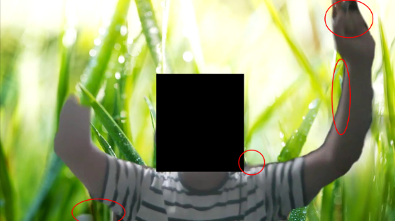
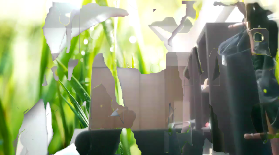

# Roomg-Attack
Privacy invasion attack that reconstruct real rooms through holes in virtual background.  

## What is Roomg-Attack?
Roomg-Attack is a privacy invasion attack that uses the instability of virtual background.
Recently, COVID-19 has required us to work from home.
The real background of the room is a treasure trove of information, the view outside the window identifies the location of our home, and the objects represent personality.
To protect our privacy we use virtual background.
This attack is an invasion of privacy by reconstructing the real background through the cracks in that virtual background.

## New attack surface
We found that the holes in virtual background contain at least one pixel of information about the real background.
The faster we move, the wider this hole gets, but no one in the world is paying attention.
**This is 0day of the real world.**

  

We manually collected and pieced together the red circles in the image. Fortunately we have many frames.
The result was fabulous!
We were able to reconstruct a real background.

  

## Automation algorithm

## Evaluation
**[The Technical Report](http://id.nii.ac.jp/1001/00209447/)** has more details.

## Author
Satoki Tsuji ([@satoki00](https://twitter.com/satoki00))  
Ryusei Ishikawa ([@ryusei_ishika](https://twitter.com/ryusei_ishika))  

## Timeline
**September 24, 2020** We discovered the idea of Roomg-Attack for the first time in the world (**[Link](https://qiita.com/satoki/items/2770a28fd319113ca31b)**)  
**October 03, 2020** We have published a proof of concept for Roomg-Attack (**[Link](https://github.com/satoki/roomg)**)  
**October 27, 2020** We have released python software (**[Link](https://pypi.org/project/zoomg/)**)  
**October 31, 2020** We presented Roomg-Attack at AVTOKYO (**[Link](https://www.avtokyo.org/2020/event#h.3xesf54ajoe3)**)  
**February 22, 2021** Our technical report has been published (**[Link](http://id.nii.ac.jp/1001/00209447/)**)  
**March 01, 2021** We presented Roomg-Attack at ICSS (**[Link](https://www.ieice.org/ken/paper/20210301ZCDg/eng/)**)  
**June 21, 2021** Our research won an award (**[Link](https://www.ieice.org/iss/icss/award.html#2020)**)  
**July 07, 2022** We published this page  
